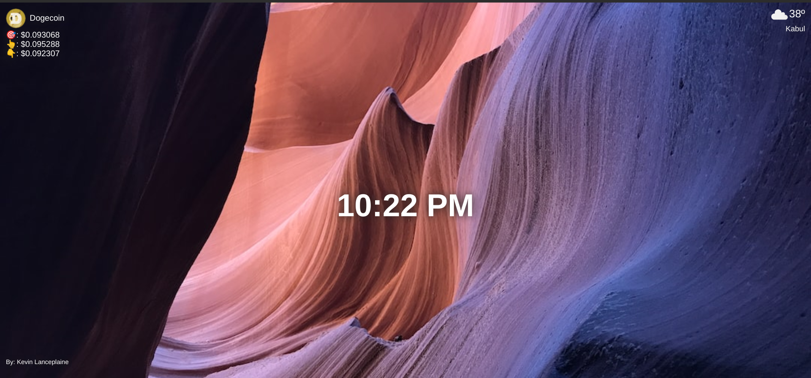
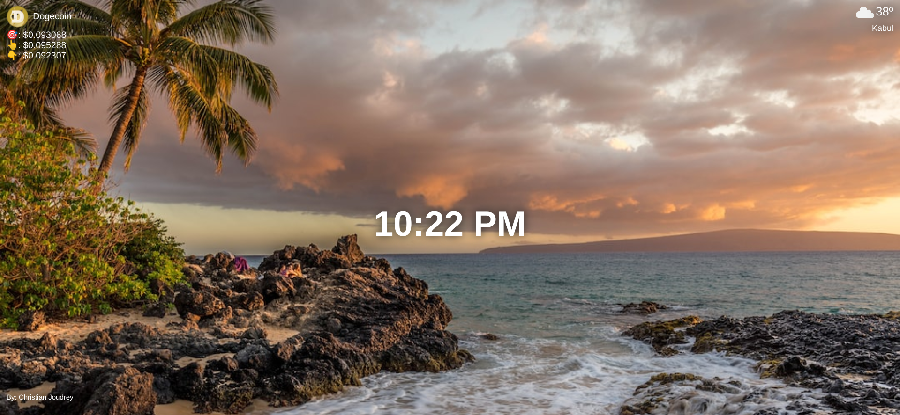

# Chrome-extension-real-project

A wonderful Chrome Extension Personal Dashboard project which you can add to you chrome and get lots of
random background images :)





## Cloning the project 🪛🔨

```
# Clone this repository
$ git clone https://github.com/MastooraTurkmen/chrome-extension-real-project.git


# Go inside the repository
$ cd chrome-extension-real-project
```


----

## Languages and Tools are used 🗣️🔧

1. **Languages** 🗣️

    + [HTML](https://github.com/topics/html)
    + [HTML5](https://github.com/topics/html5)
    + [CSS](https://github.com/topics/css)
    + [CSS3](https://github.com/topics/css3)
    + [JavaScript](https://github.com/topics/javascript)


2. **Tools** 🔧

    + [Chrome](https://github.com/topics/chrome)
    + [Figma](https://github.com/topics/figma)
    + [VSCode](https://github.com/topics/vscode)
    + [Netlify](https://github.com/topics/netlify)


-----


## Deployment 📥

1. How to deploy our project to the ***Netlify*** site?
2. I use [Netlify App](https://app.netlify.com/) for deploying my projects.
4. From there select **_Deploy with Github_**.
5. Then write your project name and select it.
6. After selecting here you can see that the project **_Review configuration for chrome-extension-real-project_** and then select the **_Deploy chrome-extension-real-project_** Button.
7. Now your project is Live.

------


## Author 👩🏻‍💻

**Mastoora Turkmen**

[LinkedIn](https://www.linkedin.com/in/mastoora-turkmen/) 
<br>
[Github](https://github.com/MastooraTurkmen/) 
<br>
[Twitter](https://twitter.com/MastooraJ22)


# Codes are used in Project

1. ***Index HTML***
2. ***Index CSS***
3. ***Index JS***
4. ***manifest json***


## ***Index HTML***

```html

<!DOCTYPE html>
<html lang="en">
<head>
  <meta charset="UTF-8">
  <meta name="viewport" content="width=device-width, initial-scale=1.0">
  <link rel="icon" type="image/svg+xml" href="./images/icon.png" />
  <link rel="stylesheet" href="https://cdnjs.cloudflare.com/ajax/libs/normalize/8.0.1/normalize.css">
  <link rel="stylesheet" href="index.css">
  <title>Personal Dashboard</title>
</head>
<body>
  <main>    
    <div class="top">
      <div id="crypto">
        <div id="crypto-top"></div>
           </div>
        <div id="weather"></div>
      </div>
        
    <h1 id="time" class="time"></h1>
    <p id="author"></p>
  </main>
<script src="index.js"></script>
</body>
</html>

```

